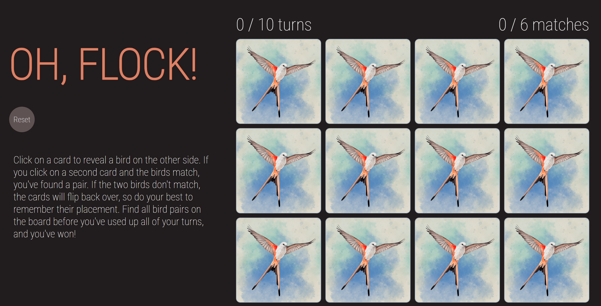

# OH, FLOCK!

#### Locate each bird pair before the turns run out!

## Description
A Wingspan-themed, single-player memory game where as the player, you flip two cards over per turn. If the cards are a match, they remain upright and you are one step closer to winning. If the cards don't match, they both flip back over again. You have ten turns total to find all matches before the game is over. Hope your memory serves you well! 

## Quick Links
* **Project planning** can be found [here](https://trello.com/b/XxLPtSdn/memory-game).
* **Wireframe** can be found [here](https://lucid.app/lucidchart/8aaecf84-a967-4391-a5d9-028f45b1acea/edit?beaconFlowId=BC1A14C6C4D919B2&invitationId=inv_2524a5b4-53ef-4e3e-a3c1-3fe477d4d70a&page=0_0#).
* **GitHub repo** can be found [here](https://github.com/annamiriams/memory-game).
* **Deployed project** link can be found [here]().

## Table of Contents
* [Technologies Used](#technologiesused)
* [Features](#features)
* [Design](#design)
* [Project Next Steps](#nextsteps)
* [About the Author](#author)
* [Works Cited](#workscited)

## Technologies Used
* JavaScript
* HTML
* CSS

## Design
* This game utilizes illustrations from the board game Wingspan. As a birdwatcher and board game enthusiast, Wingspan is one of my all time favorites. A memory game of this size is not typically considered a particularly challenging web browser game, so I attempted to make it a tad trickier by including birds with similar colored plumage. 

## Project Next Steps
* Add more card pairs on deck, allowing the user to choose a custom-sized board (i.e. 10 pairs, 14 pairs, or 18 pairs possible).
* Replace the tally board with a timer.
* Add visual effects to pair with a matched pair, win, and/or loss.

## About The Author
I'm new to coding, but experienced at problem-solving. I love to play games, and now I can say that I love building them! In my free time you'll find me reading, birdwatching, cooking, and spending time with my spouse, our dog, and two cats. 

## Works Cited:
* [Topic](link): explanation
* [Topic](link): explanation
* [Topic](link): explanation
* [Topic](link): explanation
* [Topic](link): explanation
